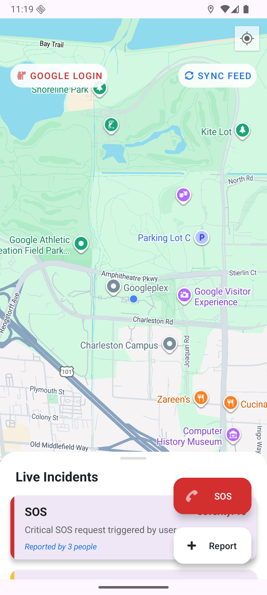
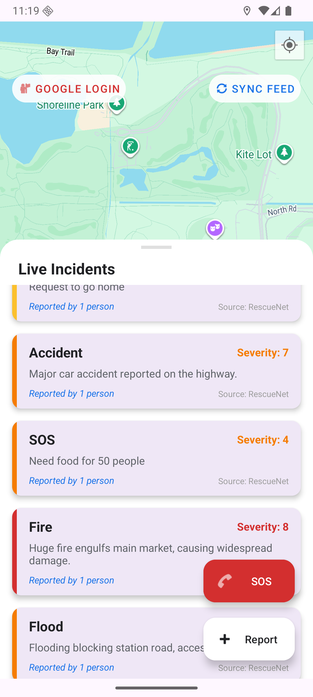
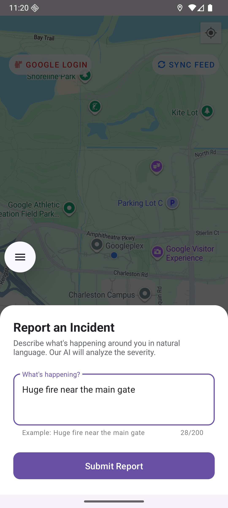
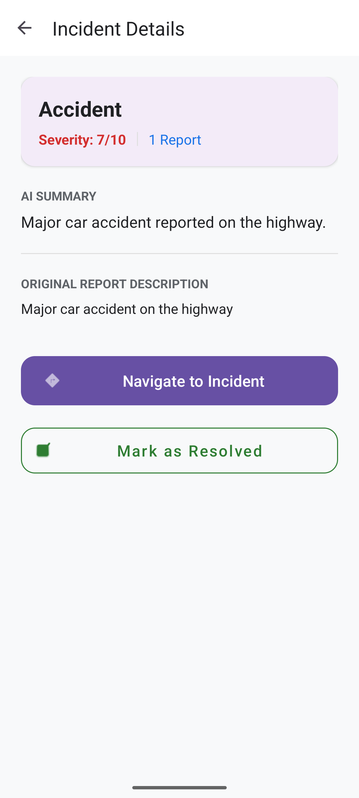

# RescueNet - AI-Powered Disaster Response 🆘


-lightgrey)

> **Note:** RescueNet is a Hackathon project.

**RescueNet** is a decentralized disaster management and coordination platform. It empowers citizens to report incidents in real-time, which are then analyzed by AI to facilitate rapid response from authorities. By integrating global feeds and local reports, it creates a unified crisis map for emergency services and the public.

---

## 📖 The "Why" Behind RescueNet

In critical situations, every second counts. Traditional reporting methods can be slow and fragmented. RescueNet streamlines this by:

### Who is this for?
1.  **First Responders:** To get real-time, AI-categorized incident data with precise locations.
2.  **Civilians:** To report emergencies instantly and see nearby hazards on a live map.
3.  **Disaster Managers:** To monitor both local incidents and global disaster feeds (GDACS) in one place.

---

## 📸 Screenshots

       


---

## ✨ Key Features

* **AI-Driven Incident Analysis:** Integrated with **Gemini 2.0 Flash** via Vertex AI to automatically categorize reports, assess severity, and identify relevant authorities.
* **Global Disaster Integration:** Real-time synchronization with **GDACS** (Global Disaster Alert and Coordination System) for international disaster monitoring.
* **Interactive Crisis Map:** A Google Maps-based UI displaying categorized incidents (Fire, Medical, Flood, SOS) with visual heat circles.
* **Rapid SOS Workflow:** One-tap emergency triggers for Police, Fire, and Ambulance services with instant location sharing.
* **Real-time Collaboration:** Powered by **Firebase Firestore** for instantaneous syncing of reports across all active users and responders.
* **Offline Resilience:** Smart local caching and background re-syncing ensures reports are captured even without immediate internet connectivity.
* **Incident Verification:** Community-driven "Resolution" system to confirm when an incident has been handled, maintaining an accurate live feed.

---

## 🛠 Tech Stack

* **Language:** Java
* **Database:** Firebase Firestore & SharedPreferences (Local Cache)
* **AI Engine:** Vertex AI (Gemini 2.0 Flash)
* **External APIs:** GDACS REST API

### UI/UX & Components
* **Material Design 3:** Modern UI using Floating Action Buttons, Bottom Sheets, and Material Dialogs.
* **Google Maps SDK:** For advanced geospatial visualization and navigation.
* **Fused Location Provider:** For high-accuracy user positioning.

### Key Libraries
* **[Firebase SDK](https://firebase.google.com/):** For Authentication (Google & Anonymous) and real-time NoSQL database.
* **[Retrofit 2](https://square.github.io/retrofit/):** For seamless integration with disaster data feeds.
* **[Credential Manager](https://developer.android.com/training/sign-in/credential-manager):** For modern, secure Google Sign-In implementation.
* **Gson:** For efficient data serialization and AI response parsing.

---

## 🚀 How to Run

1.  **Clone the repository:**
    ```bash
    git clone https://github.com/YOUR_USERNAME/RescueNet.git
    ```

2.  **Open in Android Studio:**
    Open the project directory in Android Studio (Ladybug 2024.2.1 or later recommended).

3.  **Configure API Keys:**
    Create a `local.properties` file in the root directory and add your Google Maps API Key:
    ```properties
    MAPS_API_KEY=your_google_maps_key_here
    ```

4.  **Firebase Setup:**
    * Create a project in the [Firebase Console](https://console.firebase.google.com/).
    * Add an Android app and download the `google-services.json`.
    * Place `google-services.json` in the `app/` directory.
    * Enable Firestore and Authentication (Google & Anonymous).

5.  **Build and Run:**
    Sync Gradle and run the app on an emulator or physical device (Min SDK: API 24+).

---

## 📄 License

This project is licensed under the MIT License - see the [LICENSE](LICENSE) file for details.

---

## 💡 Support the Project

If you believe in using technology for social good and disaster resilience, feel free to:

* ⭐ Star this repository.
* 🍴 Fork it and contribute to the AI analysis prompts.
* 📢 Share it with local emergency response organizations.

**Developed with ❤️ by Nishkarsh (ForTheEase)**
